<div dir="rtl">

# 🎨 System Diagrams — مخططات الترابط

> ملف بيشرح كل العلاقات في النظام بصرياً.  
> كل Diagram مكتوب بـ Mermaid syntax وبيتعرض تلقائياً في VS Code / GitHub / أي Markdown viewer بيدعم Mermaid.

---

## 1️⃣ The Big Picture — الصورة الكبيرة

```mermaid
flowchart TB
    subgraph ORG["🏢 Organization Structure"]
        B[Branches<br/>الفروع]
        D[Departments<br/>الأقسام]
        T[Teams<br/>الفرق متعددة الفروع]
    end

    subgraph HR["👥 HR Layer"]
        E[Employees<br/>الموظفين]
    end

    subgraph AUTH["🔐 Auth Layer (Optional)"]
        U[Users<br/>حسابات الدخول]
        R[Roles<br/>الأدوار]
        P[Permissions<br/>الصلاحيات]
        UR[User Roles + Scopes<br/>الإسناد بالنطاق]
    end

    B --> D
    B -.-> E
    D -.-> E
    T -.M:N.- E
    E -.0..1.-> U
    U --> UR
    R --> UR
    R --> P

    style ORG fill:#e1f5ff,stroke:#0288d1
    style HR fill:#fff4e1,stroke:#f57c00
    style AUTH fill:#f3e5f5,stroke:#7b1fa2
```

---

## 2️⃣ Entity Relationship Diagram (ERD) الكامل

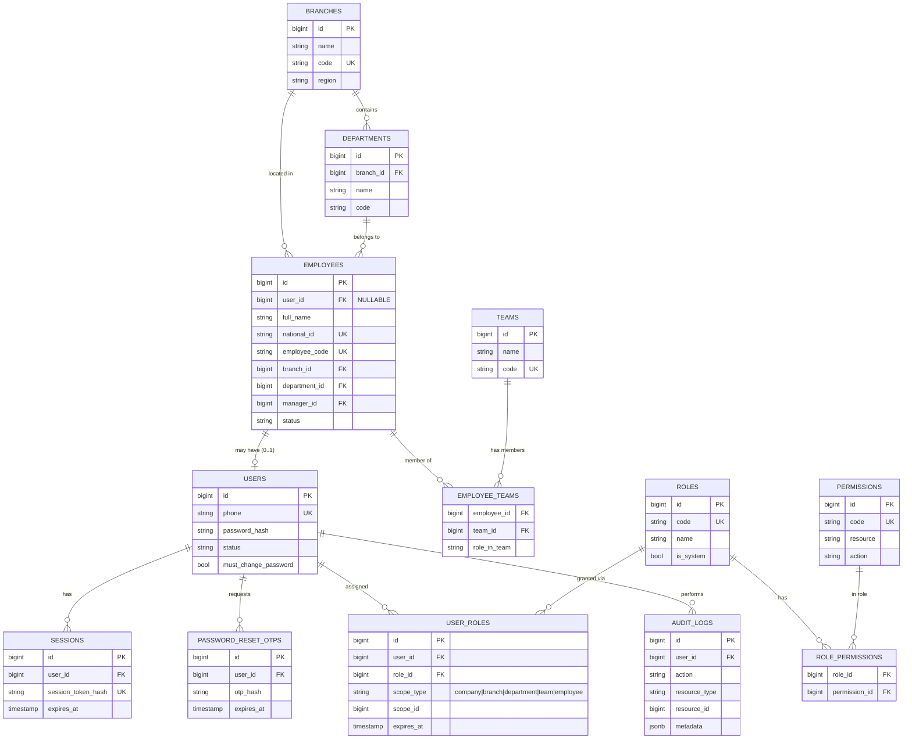

---

## 3️⃣ Build Order — ترتيب البناء

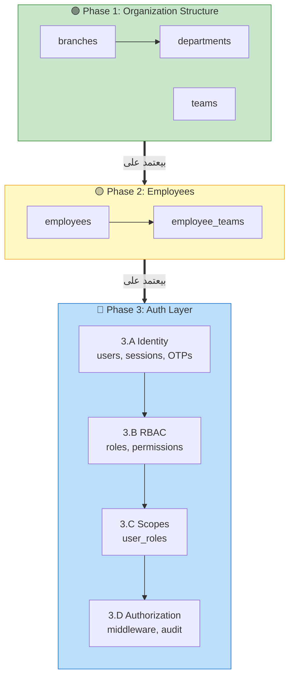

---

## 4️⃣ Two-Step Employee Creation

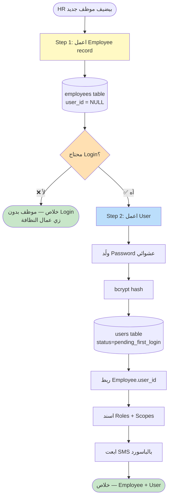

---

## 5️⃣ Authorization Flow

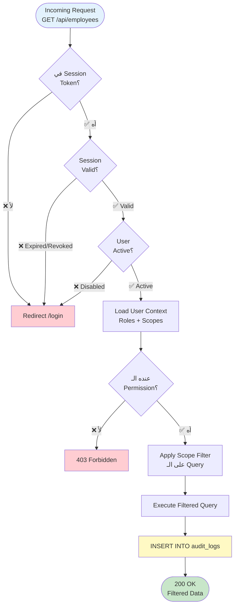

---

## 6️⃣ Scope Types

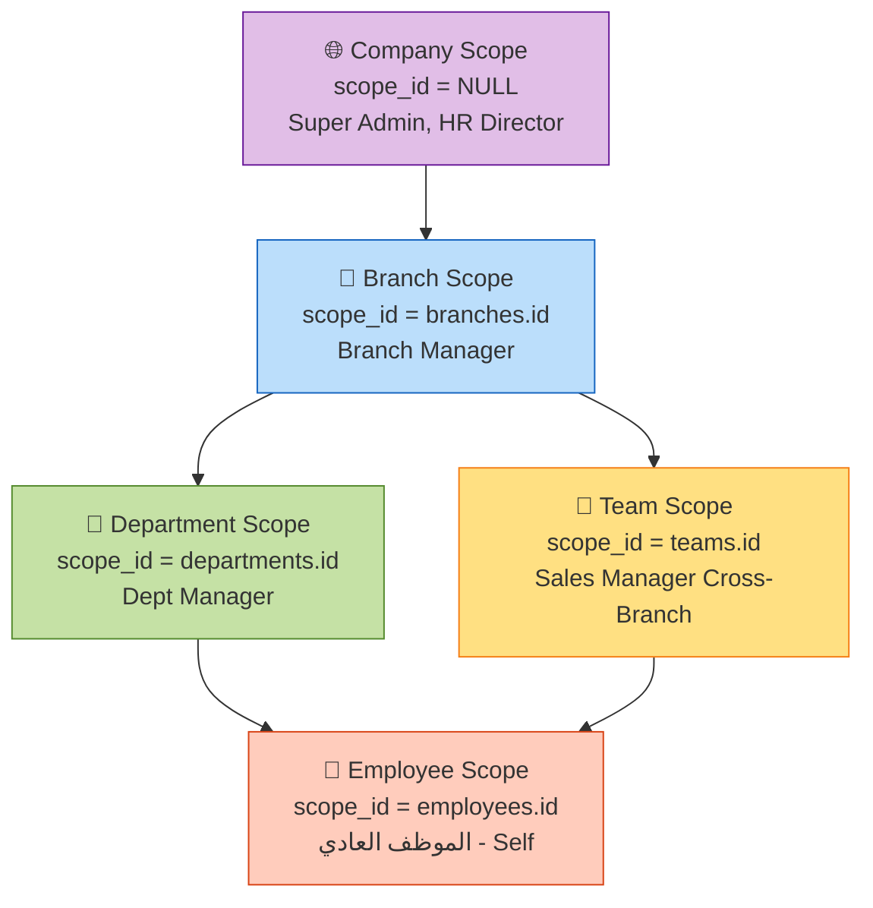

---

## 7️⃣ مثال: اتنين HR Manager في فرعين مختلفين

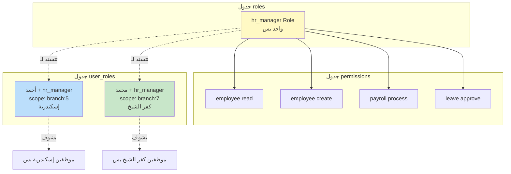

---

## 8️⃣ Sales Manager Cross-Branch — Team Scope

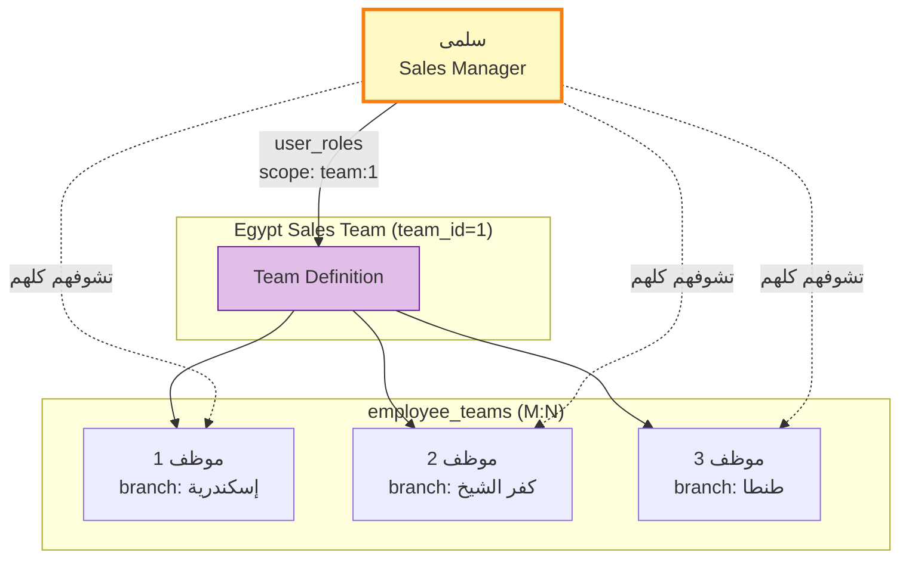

---

## 9️⃣ Layered Architecture

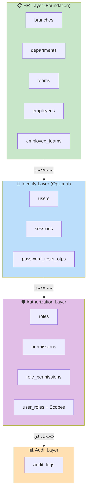

---

## 🔟 Login Flow (Sequence)

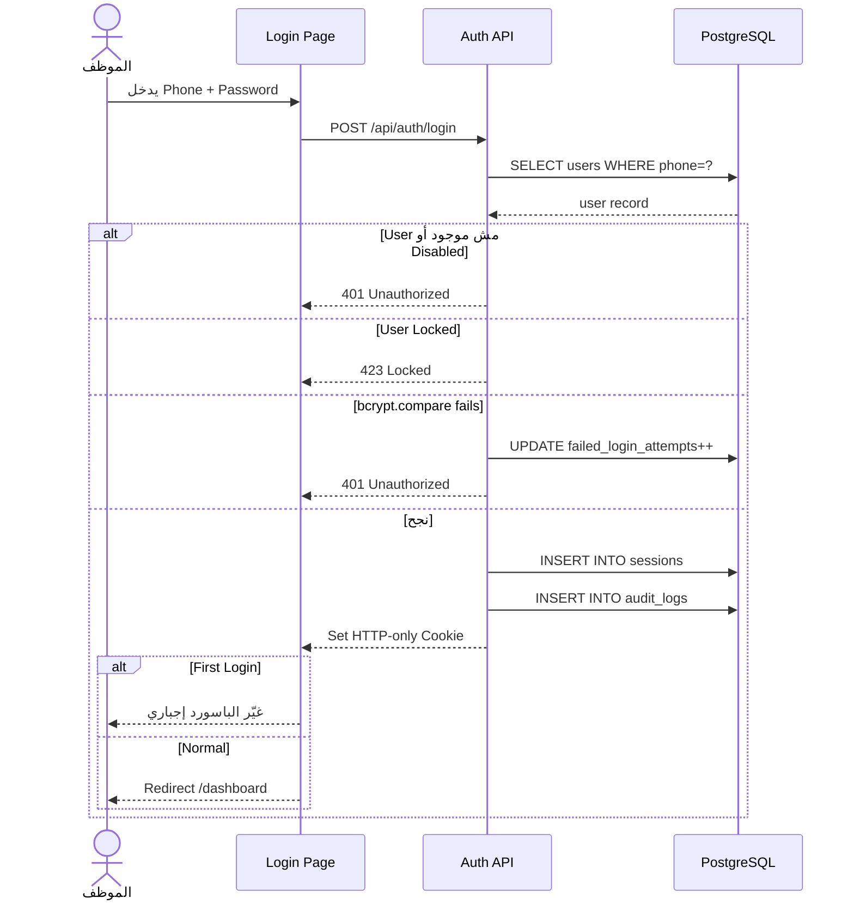

---

## 1️⃣1️⃣ Password Reset Flow

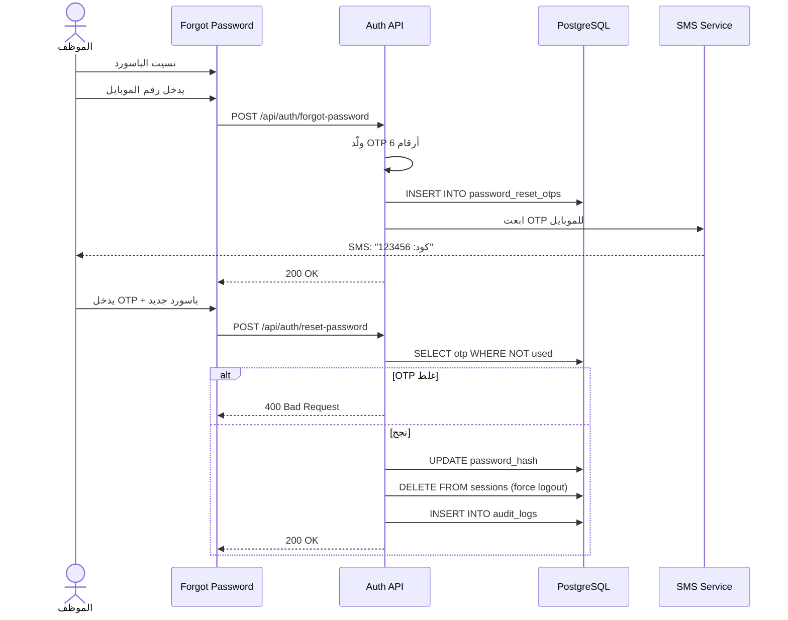

---

## 1️⃣2️⃣ Termination Flow

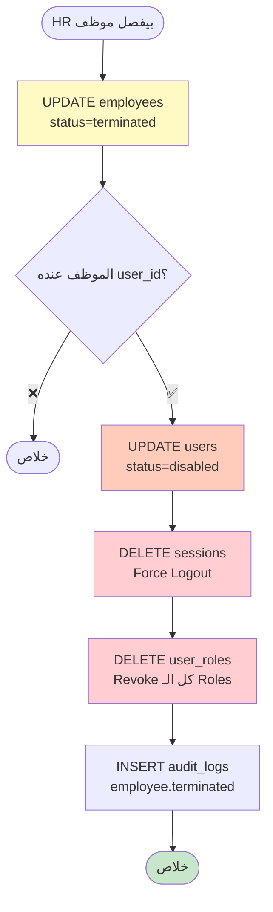

---

## 🛠️ ازاي تشوف الـ Diagrams دي؟

### في VS Code
1. ثبّت Extension: `bierner.markdown-mermaid`
2. افتح الملف واضغط `Ctrl+Shift+V`

### في GitHub
- الملف هيتعرض تلقائياً بالـ Diagrams لما تـ commit.

### Online
- [mermaid.live](https://mermaid.live) — انسخ أي Diagram وشوفه.

</div>
